# '설정' 사용자 매뉴얼

'설정'은 사용자 계정과 권한, 테넌트와 국선(노드), 인증용 클라이언트, 비밀번호·마스킹 같은 보안 정책 등 시스템 운영의 기준 정보를 다루는 영역입니다. 각 화면의 캡처와 함께 사용 방법을 안내합니다.

> 작성 기준: 2026-06-02 · 기준 커밋 0e361bd9

## 목차

- [사용자 계정 목록](#사용자-계정-목록) · [사용자 계정 추가](#사용자-계정-추가) · [사용자 계정 상세](#사용자-계정-상세)
- [역할/권한 관리](#역할권한-관리) · [역할 추가](#역할-추가) · [역할 상세](#역할-상세)
- [메뉴 관리](#메뉴-관리) · [화면 지정 관리](#화면-지정-관리) · [API 경로 관리](#api-경로-관리)
- [계정 보안 정책](#계정-보안-정책) · [작업 이력](#작업-이력) · [데이터 보관 정책](#데이터-보관-정책)
- [마스킹 정책 관리](#마스킹-정책-관리) · [마스킹 해제 요청](#마스킹-해제-요청)
- [인증용 클라이언트 목록](#인증용-클라이언트-목록) · [인증용 클라이언트 추가](#인증용-클라이언트-추가) · [인증용 클라이언트 상세](#인증용-클라이언트-상세)
- [라이선스 목록](#라이선스-목록)
- [테넌트 목록](#테넌트-목록) · [테넌트 추가](#테넌트-추가) · [테넌트 상세](#테넌트-상세)
- [국선(노드) 목록](#국선노드-목록) · [국선(노드) 추가](#국선노드-추가) · [국선(노드) 상세](#국선노드-상세) · [국선(노드) 설정](#국선노드-설정) · [클러스터 구성](#클러스터-구성) · [테넌트 자원 할당](#테넌트-자원-할당)

---

## 사용자 계정 목록

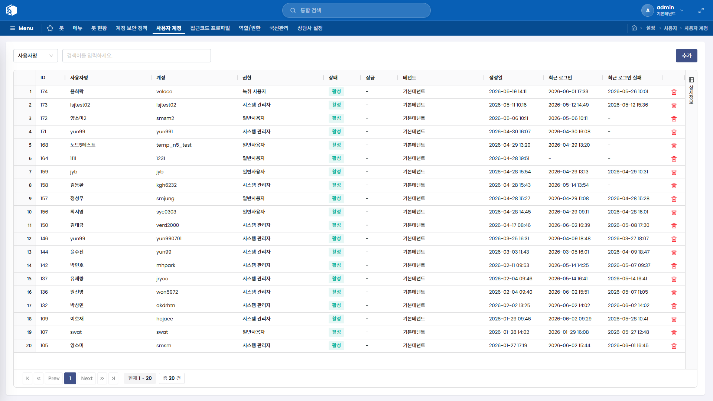

시스템에 등록된 모든 사용자 계정을 한자리에서 관리하는 화면입니다. 각 계정의 권한과 상태, 소속 테넌트, 최근 로그인 이력을 한눈에 확인할 수 있고, 상단의 검색 기준(사용자명·계정·권한)을 골라 원하는 계정을 빠르게 찾을 수 있습니다. **추가** 버튼으로 새 계정을 등록하고, 행을 더블클릭하면 해당 계정의 상세·수정 화면으로 이동합니다. 로그인이 잠긴 계정은 '잠금' 항목의 **잠금해제** 버튼으로 즉시 풀 수 있으며, 휴지통 아이콘으로 계정을 삭제합니다.

| 항목 | 설명 |
| --- | --- |
| 사용자명 / 계정 | 사용자의 표시 이름과 로그인 아이디 |
| 권한 | 부여된 역할(예: 시스템 관리자, 일반사용자) |
| 상태 | 활성 · 휴면 · 비활성 |
| 잠금 | 로그인 실패 누적 등으로 잠긴 경우 잠금해제 버튼 표시 |
| 테넌트 | 소속 테넌트 |
| 생성일 · 최근 로그인 · 최근 로그인 실패 | 계정 생성 및 로그인 관련 일시 |

---

## 사용자 계정 추가

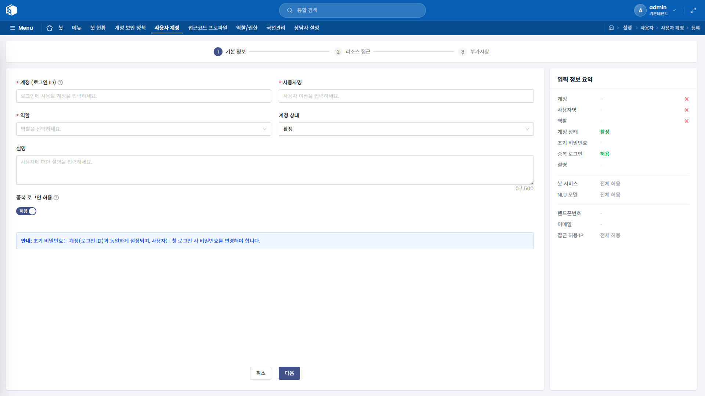

새 사용자 계정을 단계별로 등록하는 화면입니다. 상단의 단계 표시(기본 정보 → 리소스 접근 → 부가사항)를 따라 입력하며, 오른쪽 '입력 정보 요약'에서 지금까지 입력한 내용을 실시간으로 확인할 수 있습니다.

**사용 방법**

1. **기본 정보** 단계에서 계정(로그인 아이디)·사용자명·역할을 입력합니다. 필요에 따라 계정 상태, 설명, 중복 로그인 허용 여부도 설정합니다.
2. **리소스 접근** 단계에서 이 사용자가 사용할 봇 서비스와 언어 이해(NLU) 모델을 지정합니다. 지정하지 않으면 전체가 허용됩니다.
3. **부가사항** 단계에서 핸드폰번호·이메일·접근 허용 IP를 입력합니다.
4. **저장**을 누르면 계정이 만들어집니다.

| 항목 | 설명 |
| --- | --- |
| 계정 (로그인 아이디) | 영문·숫자·언더스코어(_)로 3자 이상 (필수) |
| 사용자명 | 2자 이상의 표시 이름 (필수) |
| 역할 | 부여할 권한 (필수) |
| 계정 상태 | 활성 · 휴면 · 비활성 (기본값 활성) |
| 중복 로그인 허용 | 같은 계정으로 동시에 여러 곳에서 로그인 가능 여부 |
| 봇 서비스 / 언어 이해(NLU) 모델 | 사용자가 접근할 자원. 미지정 시 전체 허용 |
| 접근 허용 IP | 로그인 가능한 IP를 제한. 미설정 시 모든 IP에서 접근 가능 |

초기 비밀번호는 계정(로그인 아이디)과 동일하게 설정되며, 사용자는 첫 로그인 시 비밀번호를 변경합니다.

---

## 사용자 계정 상세

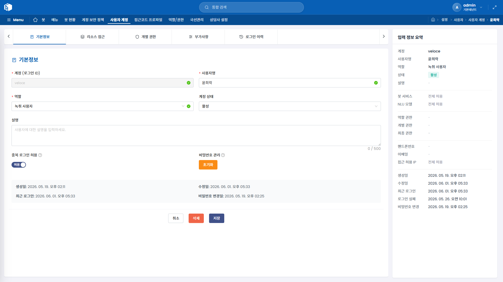

특정 사용자 계정의 정보를 확인하고 수정하는 화면입니다. 상단의 탭으로 항목을 나누어 관리하며, 오른쪽 '입력 정보 요약'에서 현재 입력 상태를 실시간으로 확인할 수 있습니다. **기본정보** 탭에서 사용자명·역할·계정 상태·설명을 수정하고 비밀번호를 초기화하며, 변경 후 하단 **저장**을 누르면 반영됩니다. 탭을 전환하면 저장하지 않은 변경은 취소됩니다.

| 탭 | 내용 |
| --- | --- |
| 기본정보 | 계정(수정 불가)·사용자명·역할·계정 상태·설명·중복 로그인·비밀번호 관리, 생성·수정·최근 로그인 정보 |
| 리소스 접근 | 사용자가 접근할 봇 서비스·언어 이해(NLU) 모델 지정 |
| 개별 권한 | 역할로 부여된 권한과 별개로 사용자에게 권한을 직접 부여·차단. 앱별로 조회(READ)·등록·수정(WRITE)·삭제(DELETE)·적용(APPLY)·내보내기(EXPORT) 권한을 표에서 선택하며, 요약에 역할 권한·개별 권한·최종 권한 수가 표시됨 |
| 부가사항 | 핸드폰번호·이메일·접근 허용 IP |
| 로그인 이력 | 조회 기간(최대 90일)을 지정해 로그인 성공·실패 기록을 확인. 일시·결과·실패 사유(예: 비밀번호 불일치)·접속 IP가 표시됨 |

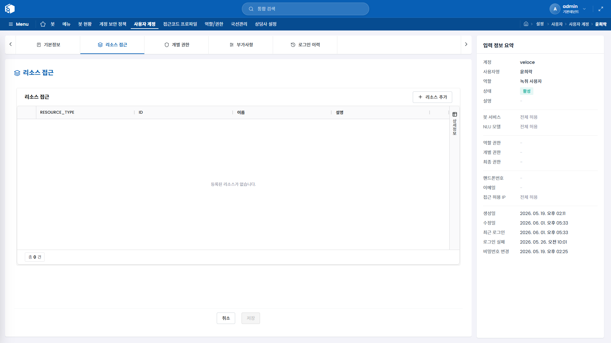

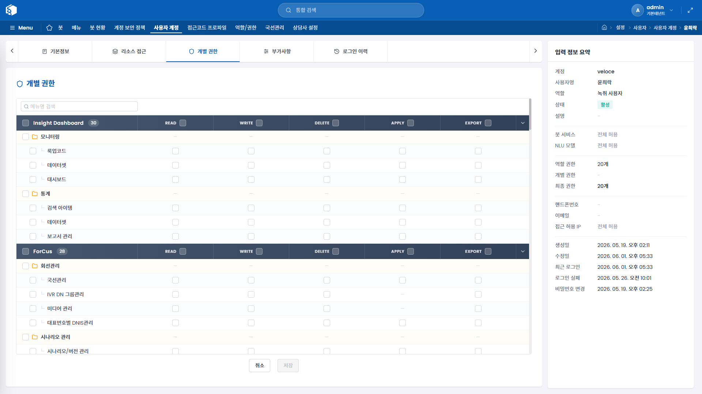

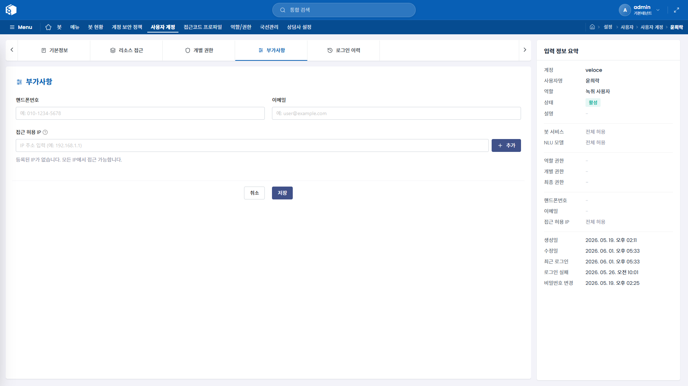

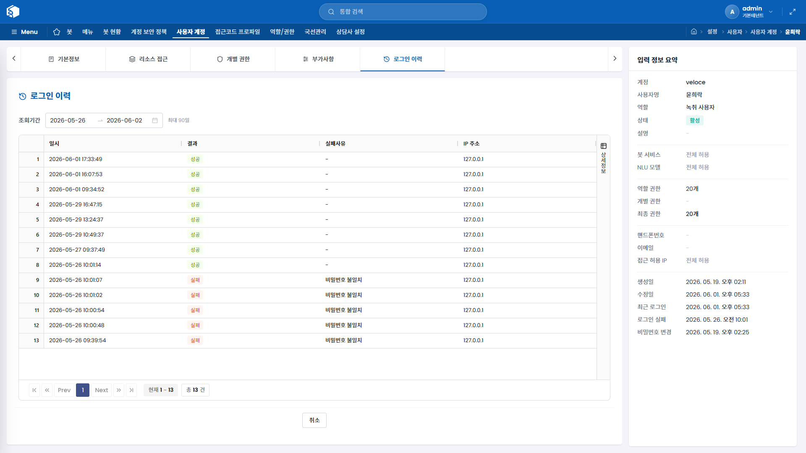

---

## 역할/권한 관리

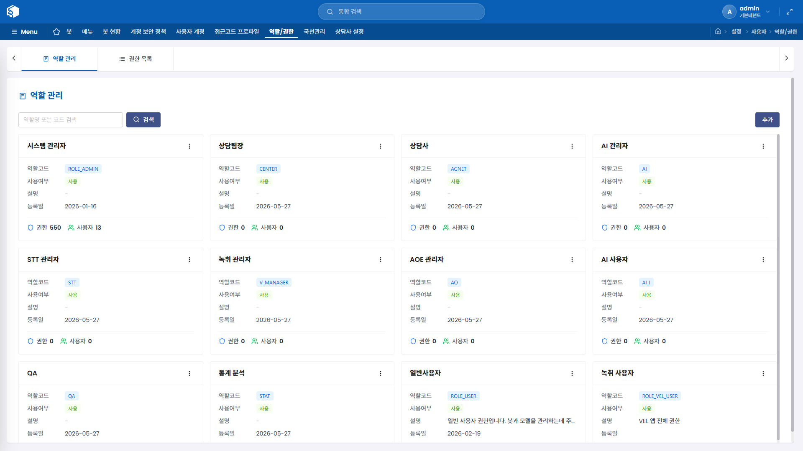

시스템에서 사용하는 역할과 각 역할이 가진 권한을 관리하는 화면입니다. '역할 관리' 탭에서는 역할을 역할명·코드로 검색하고, 각 역할의 권한 수와 소속 사용자 수를 확인하며, **추가** 버튼으로 새 역할을 만들고 카드의 더보기 메뉴로 수정·삭제합니다. '권한 목록' 탭에서는 시스템에 정의된 전체 권한 항목을 확인할 수 있습니다.

| 항목 | 설명 |
| --- | --- |
| 역할명 / 역할코드 | 역할 이름과 식별 코드(예: 시스템 관리자 / ROLE_ADMIN) |
| 사용여부 | 역할 활성 여부 |
| 권한 / 사용자 | 역할에 부여된 권한 개수와 이 역할을 가진 사용자 수 |
| 등록일 | 역할이 만들어진 날짜 |

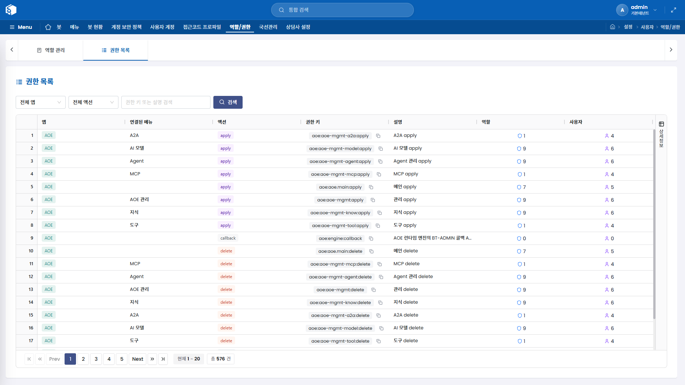

---

## 역할 추가

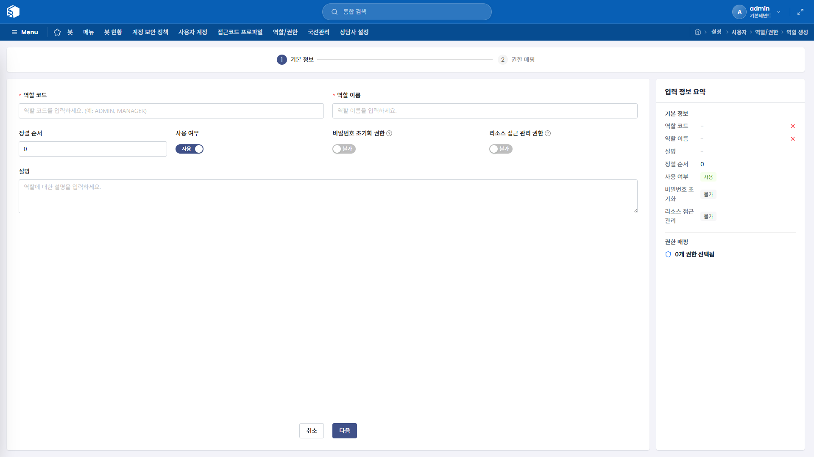

새 역할을 만들고 권한을 부여하는 화면입니다. '기본 정보'에서 역할 코드와 이름을 입력하고 사용 여부·특수 권한·설명을 설정한 뒤, '권한 매핑' 단계에서 이 역할에 부여할 권한을 선택해 저장합니다.

| 항목 | 설명 |
| --- | --- |
| 역할 코드 / 역할 이름 | 역할 식별 코드와 표시 이름 (필수) |
| 정렬 순서 | 목록에서의 표시 순서 |
| 사용 여부 | 역할 활성화 여부 |
| 비밀번호 초기화 권한 | 다른 사용자의 비밀번호를 초기화할 수 있는지 |
| 리소스 접근 관리 권한 | 사용자의 봇·모델 접근 범위를 관리할 수 있는지 |

---

## 역할 상세

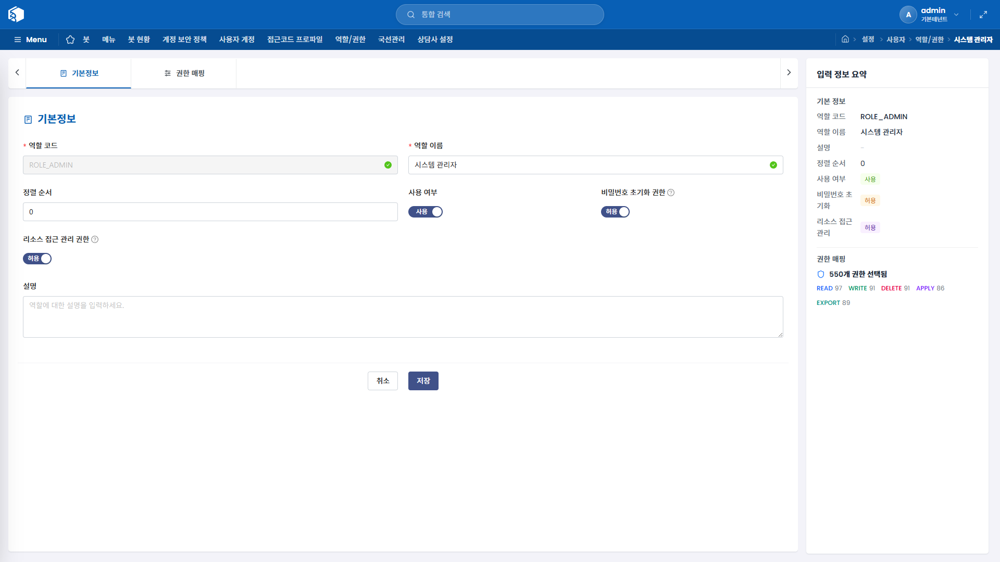

특정 역할의 정보와 권한 구성을 확인·수정하는 화면입니다. '기본정보' 탭에서 역할 이름·정렬 순서·사용 여부·특수 권한·설명을 수정하고(역할 코드는 수정 불가), '권한 매핑' 탭에서 역할이 가진 권한을 더하거나 뺍니다. 오른쪽 요약에는 선택된 권한 수가 동작 유형별로 표시됩니다.

| 권한 동작 유형 | 의미 |
| --- | --- |
| READ | 조회 |
| WRITE | 등록·수정 |
| DELETE | 삭제 |
| APPLY | 적용·실행 |
| EXPORT | 내보내기 |

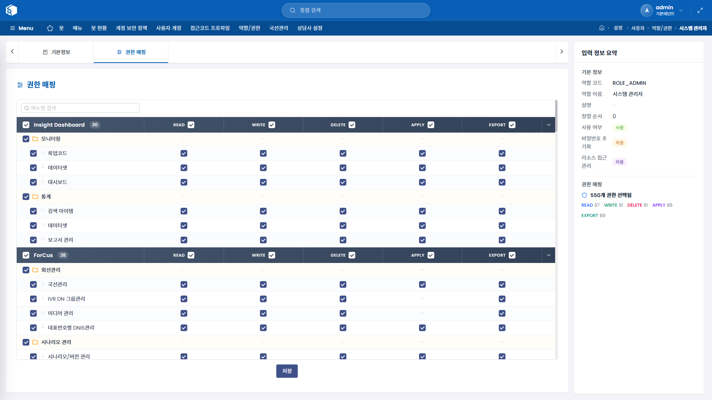

---

## 메뉴 관리

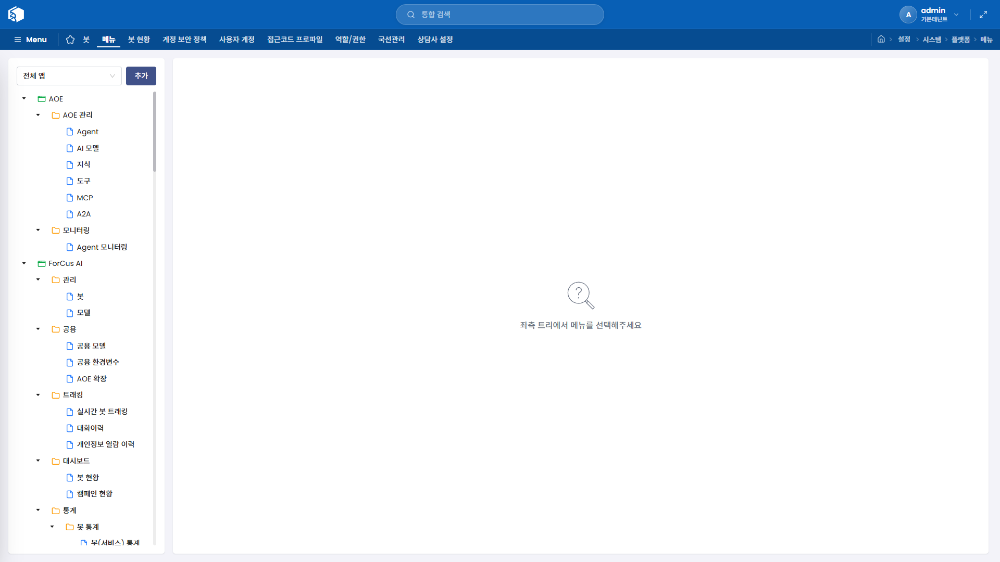

시스템에 표시되는 전체 메뉴 구조를 관리하는 화면입니다. 왼쪽 메뉴 나무 구조(트리)에서 항목을 선택하면 오른쪽에 해당 메뉴의 상세 설정이 나타납니다. 상단 선택 상자로 특정 앱 기준으로 메뉴를 걸러볼 수 있고, **추가** 버튼으로 새 메뉴를 등록합니다. 트리에서 메뉴를 펼쳐 항목을 선택한 뒤 오른쪽 패널에서 이름·경로·아이콘 등을 수정하고 저장합니다.

---

## 화면 지정 관리

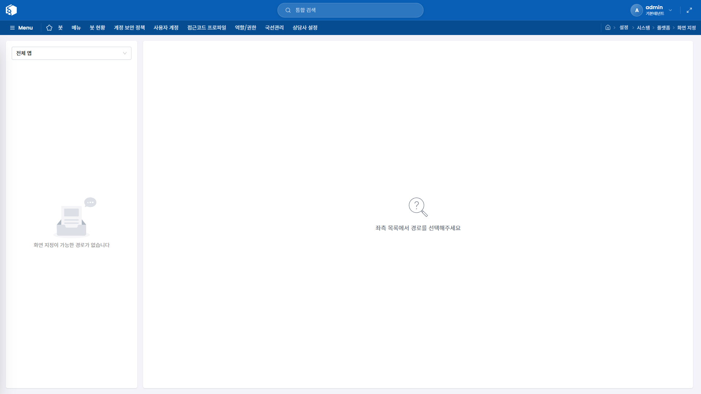

같은 메뉴 경로에서 운영 환경에 맞는 맞춤 화면을 골라 지정하는 화면입니다. 일부 경로는 여러 형태의 화면을 제공하는데, 왼쪽 목록에서 경로를 선택하면 오른쪽에 지정 가능한 맞춤 화면 카드가 나타나고, 그중 하나를 골라 적용합니다. 상단 선택 상자로 특정 앱 기준으로 경로를 걸러볼 수 있습니다.

---

## API 경로 관리

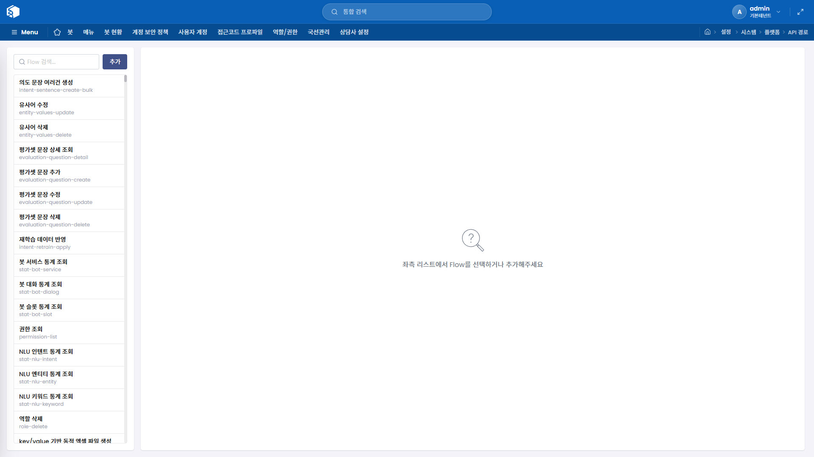

화면이 데이터를 주고받을 때 거치는 내부 API 경로를 관리하는 시스템 통합 담당자용 화면입니다. 왼쪽 목록에서 경로를 검색하거나 **추가** 버튼으로 새 경로를 만들고, 경로를 선택하면 오른쪽에서 단계별 구성을 확인·수정합니다. 구성을 바꾸면 화면 동작에 영향을 줄 수 있으므로 주의가 필요합니다.

---

## 계정 보안 정책

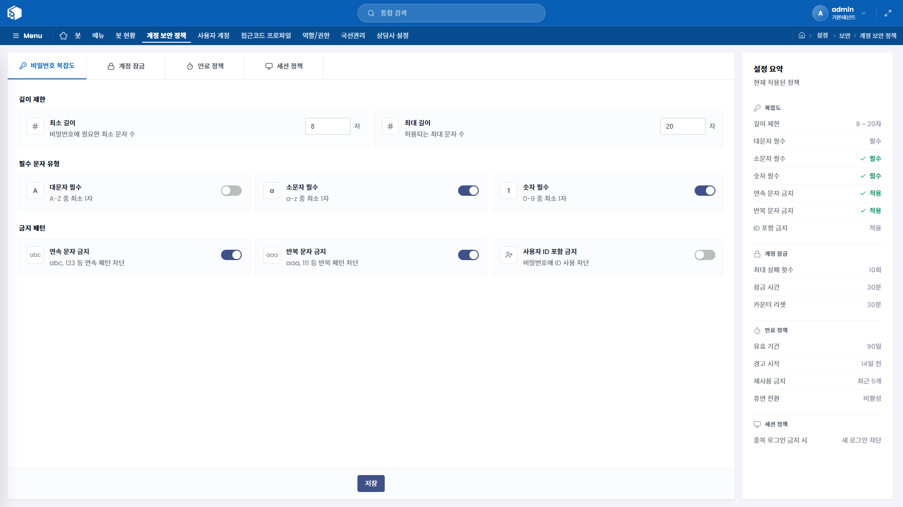

사용자 계정의 비밀번호 규칙, 로그인 잠금, 비밀번호 만료, 로그인 세션 정책을 설정하는 화면입니다. 네 개의 탭으로 나뉘며, 오른쪽 '설정 요약'에서 현재 적용된 전체 정책을 한눈에 확인할 수 있습니다. 각 탭에서 값을 조정하고 **저장**을 누르면 반영됩니다.

| 탭 | 주요 설정 |
| --- | --- |
| 비밀번호 복잡도 | 최소/최대 길이, 대문자·소문자·숫자 필수, 연속·반복 문자 및 사용자 아이디 포함 금지 |
| 계정 잠금 | 최대 실패 횟수, 잠금 시간, 실패 횟수 리셋 시간 |
| 만료 정책 | 비밀번호 유효 기간, 변경 경고 시점, 재사용 금지 개수, 휴면 전환 |
| 세션 정책 | 중복 로그인 금지 시 새 로그인 차단 여부 |

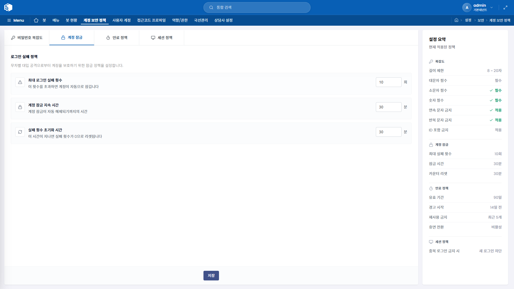

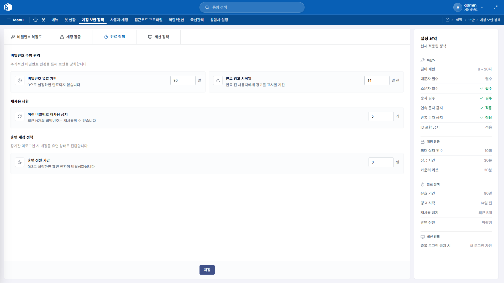

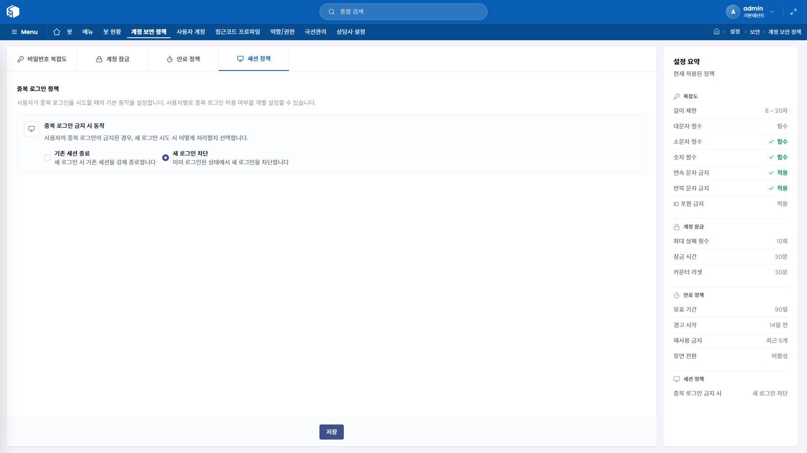

---

## 작업 이력

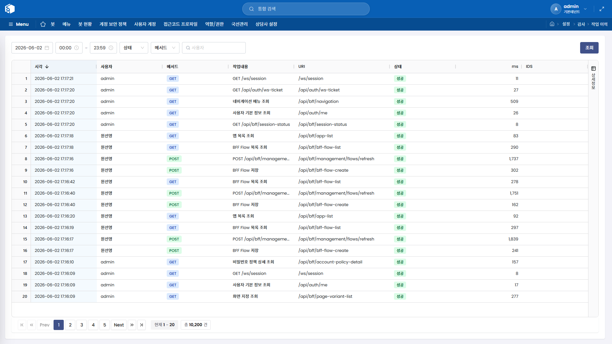

운영자가 시스템에서 수행한 작업 기록(감사 로그)을 조회하는 화면입니다. 조회 기간(시작·종료 날짜·시각)을 지정하고 처리 상태(성공·실패·부분실패)·작업 유형·사용자로 필터해 검색하며, 특정 기록의 행을 더블클릭하면 해당 작업의 상세 내용이 슬라이드 패널로 열립니다.

---

## 데이터 보관 정책

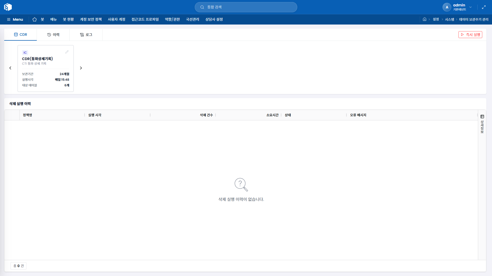

오래된 데이터를 자동으로 정리하기 위한 보관 주기를 관리하는 화면입니다. 데이터 종류별 탭(통화상세기록(CDR)·이력·로그)에서 정책 카드를 더블클릭해 보관기간과 실행시각을 편집하고, **즉시 실행** 버튼으로 정리 작업을 바로 수행합니다. 아래쪽 '삭제 실행 이력'에서 과거 정리 작업의 결과(정책명·실행 시각·삭제 건수·소요시간·상태)를 확인할 수 있습니다.

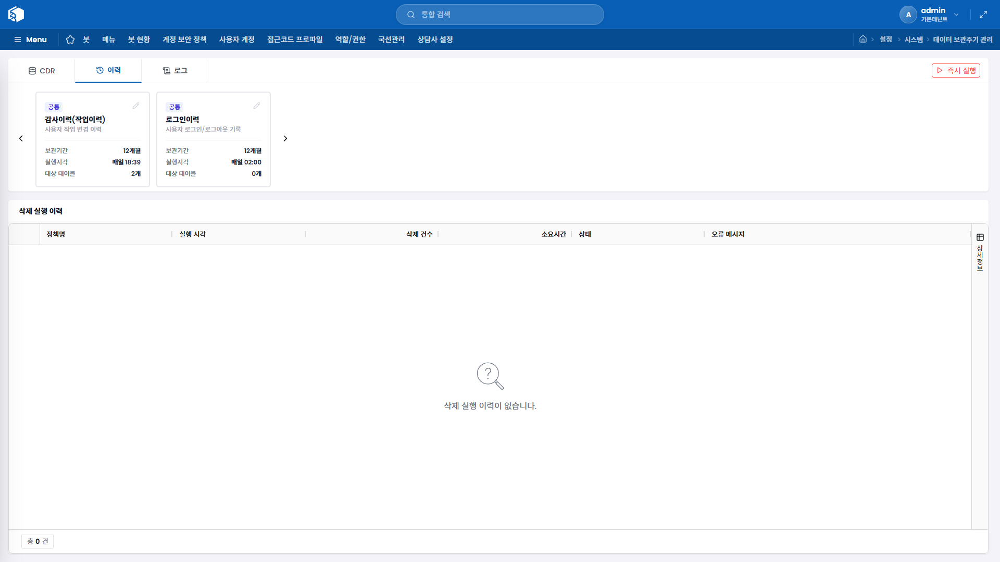

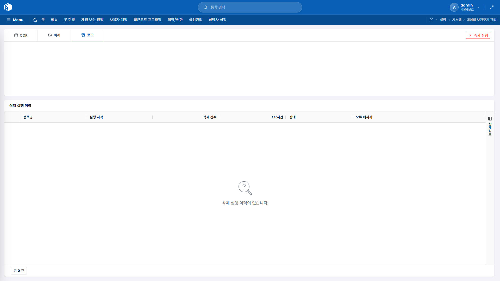

---

## 마스킹 정책 관리

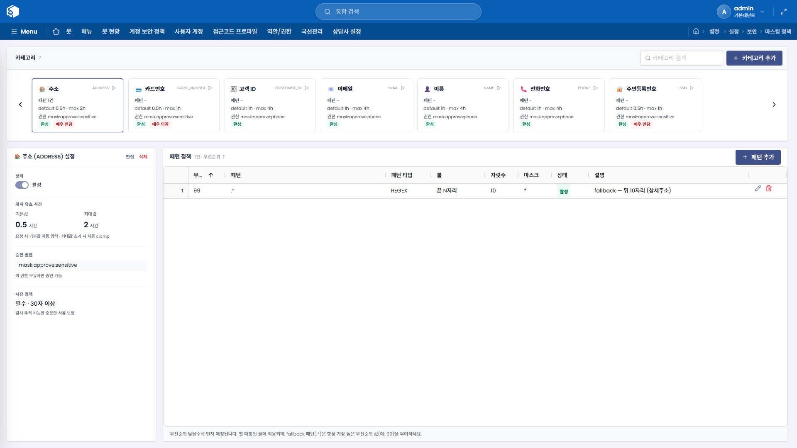

개인정보(주소·카드번호·이름·전화번호·주민등록번호 등)를 화면에서 가리는(마스킹) 규칙을 항목별로 관리하는 화면입니다. 왼쪽 목록에서 마스킹 항목을 선택하면 오른쪽에 상세 규칙이 나타나며, **카테고리 추가**로 새 항목을 만들고 항목별 **마스킹 테스트** 버튼으로 실제 결과를 미리 확인할 수 있습니다. 각 항목의 상태(활성/비활성), 마스킹 해제 유효 시간, 승인 권한, 사유 입력 정책을 편집하고, **패턴 추가**로 마스킹 규칙을 우선순위와 함께 등록합니다.

| 항목 | 설명 |
| --- | --- |
| 카테고리 | 마스킹 대상 항목(주소·카드번호·고객 아이디·이메일·이름·전화번호·주민등록번호 등) |
| 해지 유효 시간 | 마스킹 해제가 유지되는 기본/최대 시간 |
| 승인 권한 | 마스킹 해제를 승인할 수 있는 권한 |
| 사유 정책 | 해제 요청 시 사유 입력 필수 여부·최소 글자 수 |
| 패턴 정책 | 우선순위·패턴·룰·자릿수·마스크 문자로 구성된 마스킹 규칙 |

우선순위가 낮을수록 먼저 적용되며, 첫 매칭된 규칙이 적용됩니다.

---

## 마스킹 해제 요청

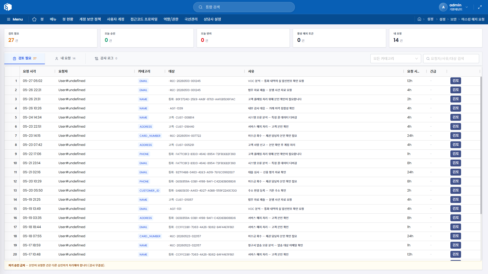

가려진 개인정보를 일시적으로 풀어 보기 위한 '마스킹 해제 요청'을 접수·검토·승인하는 화면입니다. 상단에 검토 필요·오늘 승인·오늘 반려·활성 해제 토큰·내 요청 건수가 요약되고, 아래 목록에서 각 요청의 사유와 대상을 확인한 뒤 행의 **검토** 버튼으로 승인 또는 반려를 처리합니다. 카테고리·요청자·사유·대상으로 검색할 수 있습니다.

| 항목 | 설명 |
| --- | --- |
| 요청 시각 / 요청자 | 요청 일시와 요청한 사용자 |
| 카테고리 | 해제 대상 정보 종류(주소·카드번호·이름·전화번호 등) |
| 대상 | 해제 대상 데이터 식별자(통화·고객·녹취 번호 등) |
| 사유 | 요청 사유 |
| 요청 시간 | 해제 유지 요청 시간(예: 1h, 4h) |

본인이 요청한 건은 다른 승인자가 처리합니다(감사 무결성).

---

## 인증용 클라이언트 목록

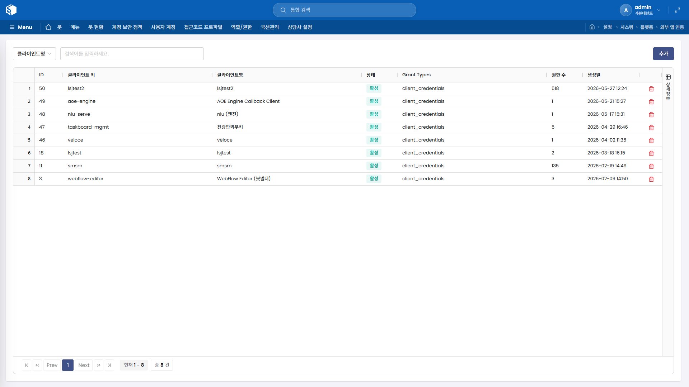

외부 앱이 시스템에 안전하게 연동하도록 발급하는 인증용 클라이언트를 관리하는 화면입니다. 클라이언트명·키로 검색하고, **추가** 버튼으로 새 클라이언트를 발급하며, 행을 더블클릭해 상세·수정하거나 삭제합니다.

| 항목 | 설명 |
| --- | --- |
| 클라이언트 키 / 클라이언트명 | 외부 앱이 사용하는 식별 키와 표시 이름 |
| 상태 | 활성 · 비활성 |
| Grant Types(허용 방식) | 클라이언트가 사용할 수 있는 인증 방식 |
| 권한 수 / 생성일 | 부여된 권한 개수와 발급 일시 |

---

## 인증용 클라이언트 추가

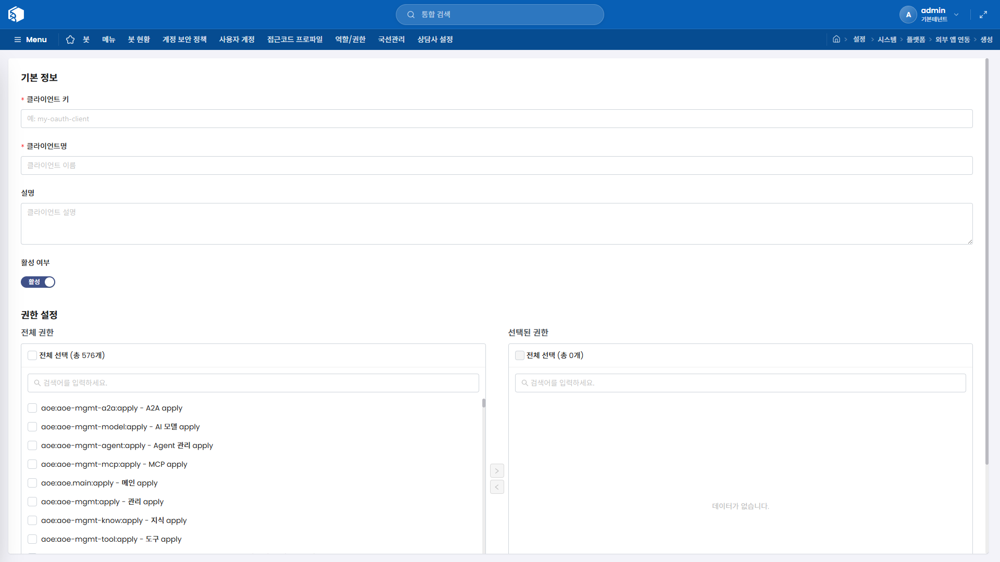

새 인증용 클라이언트를 발급하고 권한을 부여하는 화면입니다. 클라이언트 키·이름·설명·활성 여부를 입력하고, '권한 설정'에서 전체 권한 목록 중 이 클라이언트에 부여할 권한을 골라 '선택된 권한'으로 옮긴 뒤 **생성**을 누릅니다.

생성 완료 시 비밀 키(클라이언트 시크릿)가 **한 번만** 표시됩니다. 외부 앱 연동에 필요하므로 그 자리에서 복사해 안전하게 보관하세요.

---

## 인증용 클라이언트 상세

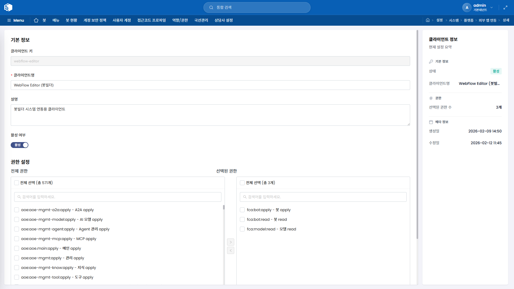

발급된 인증용 클라이언트의 정보와 권한을 확인·수정하는 화면입니다. 클라이언트명·설명·활성 여부를 수정하고 부여된 권한을 더하거나 빼며, 비밀 키를 재발급할 수 있습니다. 비밀 키를 재발급하면 기존 키는 즉시 무효화되므로, 연동 중인 외부 앱의 설정도 함께 갱신해야 합니다.

---

## 라이선스 목록

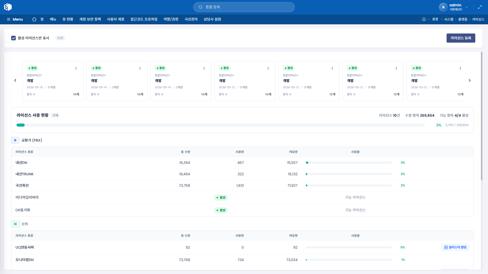

시스템에 등록된 라이선스와 사용 현황을 확인하는 화면입니다. 왼쪽에는 등록된 라이선스 카드(종류·등록일·유효 기간·항목 수·활성 상태)가, 오른쪽에는 종류별 사용 현황이 표시됩니다. **라이선스 등록** 버튼으로 새 라이선스를 등록하고, 사용 현황에서 교환기(PBX)·CTI·IVR·VELOCE 등 종류별 총 수량·사용량·여유량·사용률을 확인하며, 수량형 라이선스는 **클러스터 할당** 버튼으로 자원을 배분합니다.

---

## 테넌트 목록

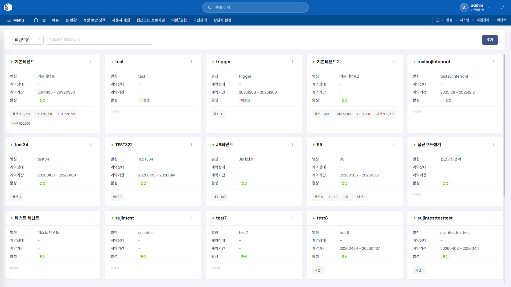

시스템을 함께 사용하는 테넌트(고객사·조직 단위)를 관리하는 화면입니다. 각 테넌트 카드에서 계약 상태와 할당된 자원(국선·DID·CTI·내선)을 확인할 수 있고, 테넌트명으로 검색하거나 **추가** 버튼으로 새 테넌트를 등록하며, 카드의 더보기 메뉴로 상세·수정·삭제합니다.

---

## 테넌트 추가

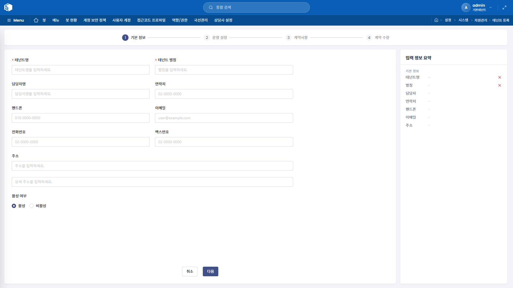

새 테넌트를 단계별로 등록하는 화면입니다. '기본 정보 → 운영 설정 → 계약사항 → 계약 수량' 네 단계로 입력하며, 오른쪽 요약에서 진행 상황을 확인합니다.

**사용 방법**

1. **기본 정보** — 테넌트명·별칭을 입력하고(필수), 담당자·연락처·이메일·주소 등을 채운 뒤 활성 여부를 선택합니다.
2. **운영 설정** — 테넌트 운영에 필요한 설정을 입력합니다.
3. **계약사항** — 계약 상태와 기간 등 계약 정보를 입력합니다.
4. **계약 수량** — 국선·DID·CTI·내선 등 자원 할당 수량을 지정합니다.
5. 마지막 단계에서 저장하면 테넌트가 등록됩니다.

---

## 테넌트 상세

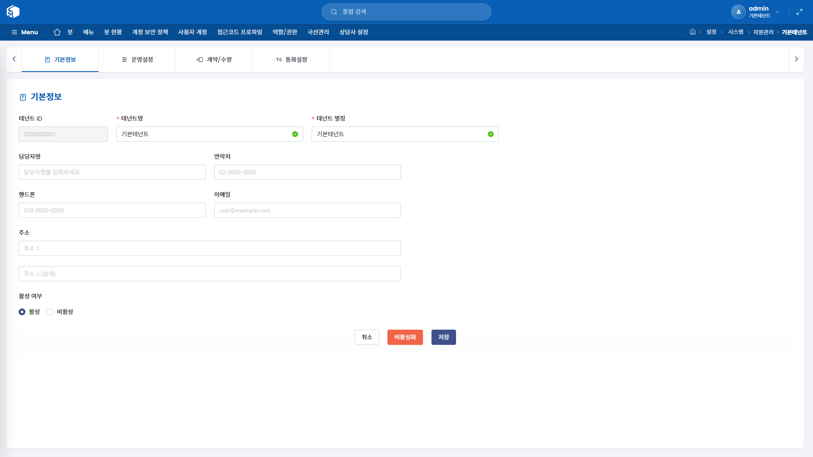

특정 테넌트의 정보를 확인하고 수정하는 화면입니다. 상단의 탭으로 항목을 나누어 관리하며, 필요 시 테넌트를 비활성화할 수 있습니다.

| 탭 | 내용 |
| --- | --- |
| 기본정보 | 테넌트 아이디(수정 불가)·테넌트명·별칭·담당자·연락처·이메일·주소·활성 여부 |
| 운영설정 | 테넌트 운영에 필요한 세부 설정 |
| 계약/수량 | 계약 상태·기간 및 국선·DID·CTI·내선 등 자원 할당 수량 |
| 통화설정 | 통화 관련 설정 |

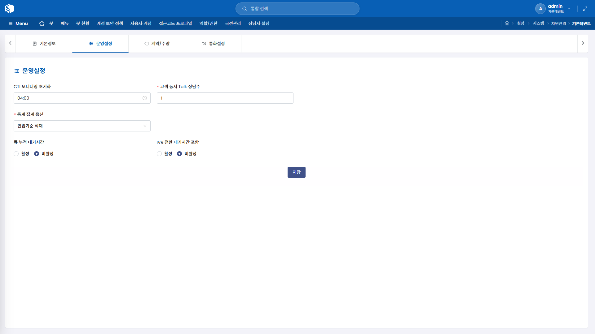

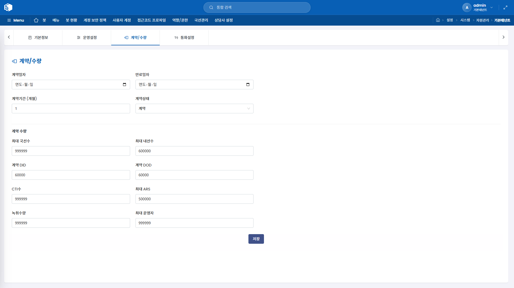

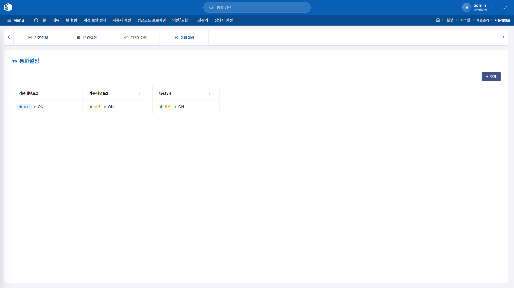

---

## 국선(노드) 목록

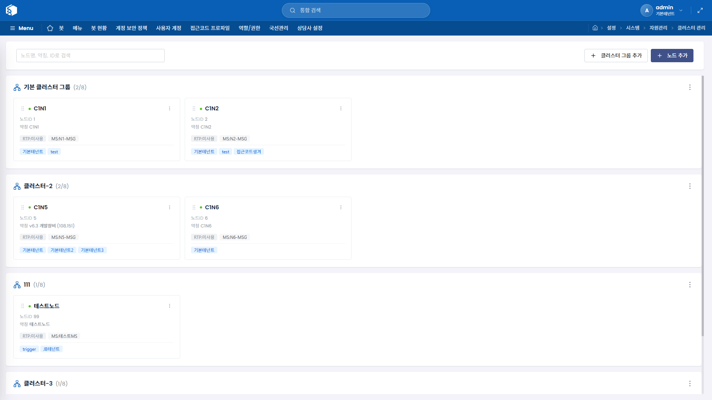

통화 처리를 담당하는 노드(국선 장비)를 클러스터 그룹 단위로 관리하는 화면입니다. 클러스터별로 묶인 노드 카드에서 약칭과 음성 전송(RTP)·미디어 처리 서버(MS) 설정, 배정된 테넌트를 확인할 수 있습니다. 노드명·약칭·아이디로 검색하고, **클러스터 그룹 추가**·**노드 추가** 버튼으로 그룹과 노드를 만들며, 노드 카드를 끌어다 다른 그룹으로 옮기거나 더보기 메뉴로 상세·설정·삭제합니다.

---

## 국선(노드) 추가

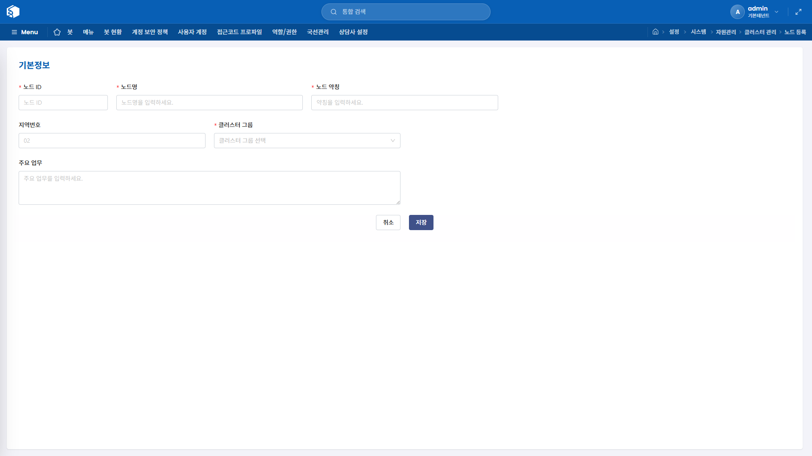

새 노드(국선 장비)를 등록하는 화면입니다. 노드 아이디·노드명·약칭을 입력하고(필수) 소속할 클러스터 그룹을 선택한 뒤, 필요하면 지역번호·주요 업무를 채워 저장합니다.

---

## 국선(노드) 상세

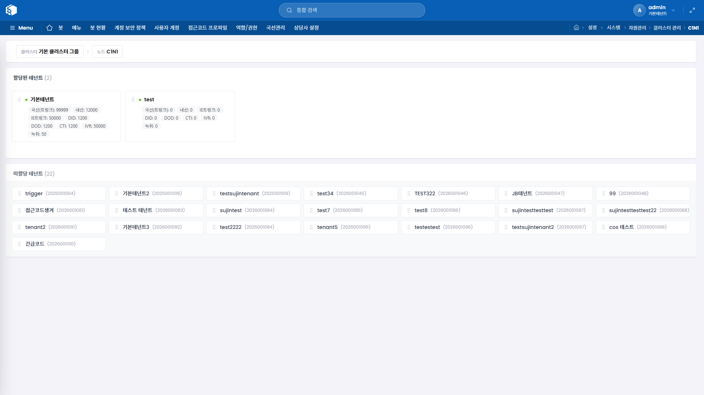

특정 노드에 어떤 테넌트가 배정되어 있는지 확인하고, 테넌트를 노드에 배정·해제하는 화면입니다. 위쪽 '할당된 테넌트'에서 각 테넌트의 자원 수량(국선·내선·DID·CTI·IVR·녹취 등)을 확인하고, 아래쪽 '미할당 테넌트'를 끌어다 노드에 배정하거나 할당된 테넌트를 끌어내 해제합니다.

---

## 국선(노드) 설정

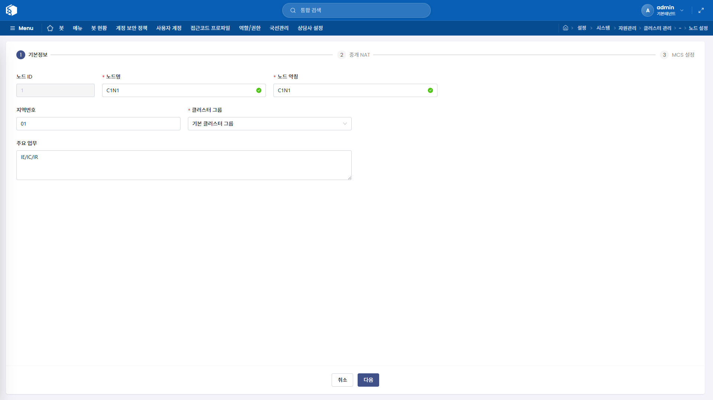

노드의 세부 동작을 단계별로 설정하는 통신 인프라 담당자용 화면입니다. '기본정보 → 중개 NAT → MCS 설정' 세 단계로 구성되며, 노드명·약칭·지역번호·클러스터 그룹과 주소 변환(중개 NAT), 미디어 처리 서버(MCS) 설정을 입력합니다. 설정을 잘못 변경하면 통화 처리에 영향을 줄 수 있습니다.

---

## 클러스터 구성

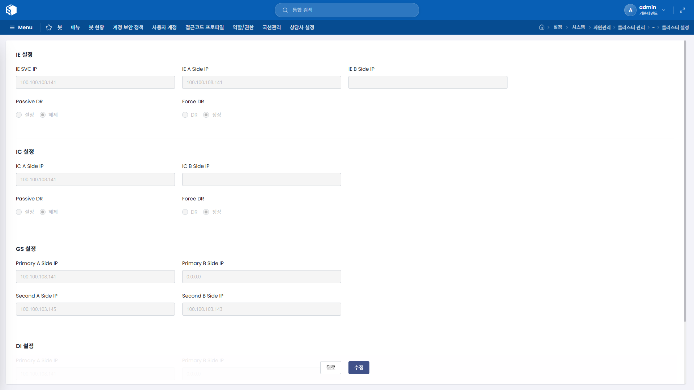

노드가 속한 클러스터의 통신 장비 주소(IP)와 이중화(DR) 설정을 관리하는 통신 인프라 담당자용 화면입니다. IE·IC·GS·DI 등 구성 요소별로 서비스 주소와 A/B 계열 주소, 재해 복구(DR) 관련 설정을 확인하고 **수정** 버튼으로 편집합니다. 주소·이중화 설정을 잘못 변경하면 서비스 장애로 이어질 수 있으므로 주의가 필요합니다.

---

## 테넌트 자원 할당

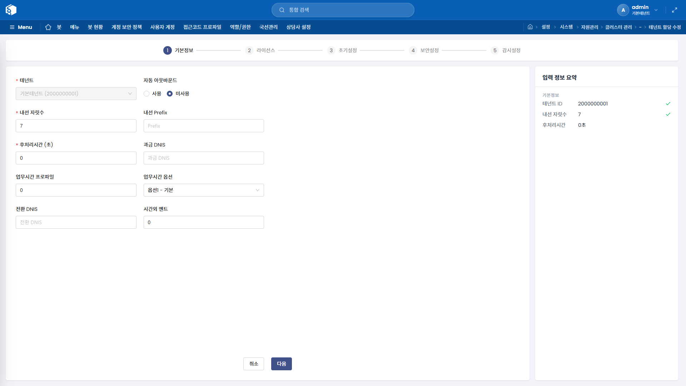

특정 노드에 테넌트를 배정할 때 그 테넌트의 운영 조건을 단계별로 설정하는 화면입니다. '기본정보 → 라이선스 → 초기설정 → 보안설정 → 감시설정' 다섯 단계로 입력하며, 오른쪽 요약에서 진행 상황을 확인합니다.

| 단계 | 내용 |
| --- | --- |
| 기본정보 | 내선 자릿수·내선 Prefix·후처리시간·자동 아웃바운드·업무시간 옵션·시간외 멘트 등 운영 조건 |
| 라이선스 | 테넌트에 배정할 자원(라이선스) 수량 |
| 초기설정 | 운영에 필요한 초기값 |
| 보안설정 | 보안 관련 설정 |
| 감시설정 | 모니터링 관련 설정 |
