# 'STT' 사용자 매뉴얼

> 작성 기준: 2026-06-09 · 기준 커밋 f57d3f37

STT(Speech-to-Text) 시스템의 통화 음성 변환 결과를 조회·관리하고, 음성 인식 품질을 개선하며, 실시간 변환 현황을 모니터링하는 화면 모음입니다.

## 목차

### STT 관리
- [STT 검색](#stt-검색)
- [사전 관리](#사전-관리)
- [인식률측정 관리](#인식률측정-관리)
- [STT 내선 관리](#stt-내선-관리)
- [STT 재처리 현황](#stt-재처리-현황)
- [STT 파일업로드](#stt-파일업로드)

### STT 모니터링
- [STT 채널현황](#stt-채널현황)
- [STT 내선별 진행현황](#stt-내선별-진행현황)
- [STT 콜별 진행현황](#stt-콜별-진행현황)
- [STT 대시보드](#stt-대시보드)

---

## STT 관리

### STT 검색

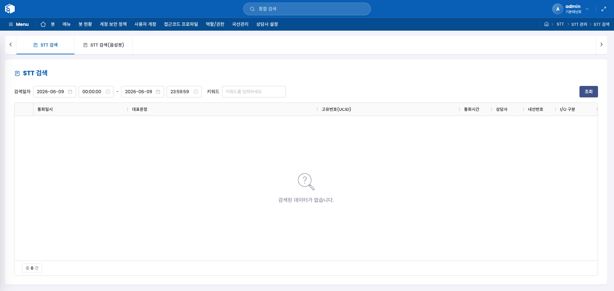

통화 내용을 STT로 변환한 결과를 날짜·시간 범위와 키워드로 검색하는 화면입니다. **STT 검색**과 **STT 검색(음성봇)** 두 탭으로 구성됩니다.

**STT 검색** 탭에서는 날짜·시간 범위와 키워드를 조합해 통화 목록을 조회하고, 행을 두 번 클릭하면 해당 통화의 전체 STT 변환 내용을 확인할 수 있습니다.

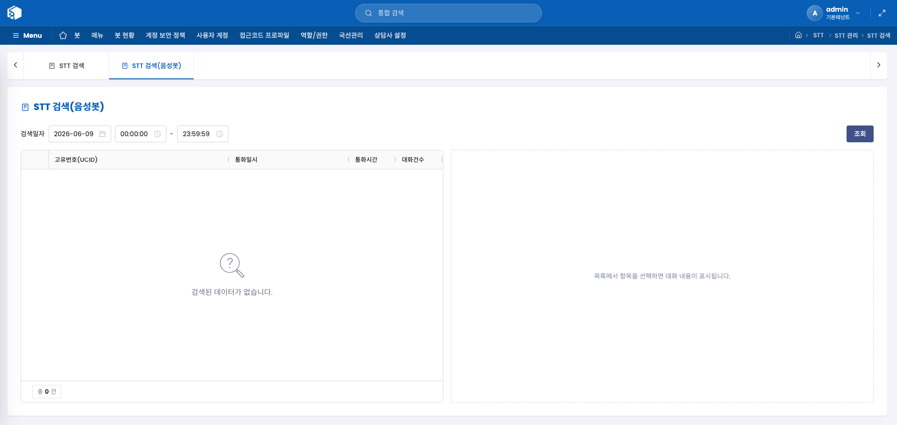

**STT 검색(음성봇)** 탭은 음성봇 통화 전용입니다. 화면 왼쪽에서 통화를 선택하면 오른쪽에 해당 통화의 대화 내용이 펼쳐지며, 행을 두 번 클릭하면 상세 변환 내용을 볼 수 있습니다.

#### 화면 항목 — STT 검색 탭

| 항목 | 설명 |
|---|---|
| 날짜·시간 범위 | 조회 시작·종료 일시 설정 |
| 키워드 | 대화 내용에서 검색할 단어 |
| 통화일시 | 통화가 이루어진 날짜와 시간 |
| 대표문장 | STT로 변환된 통화 요약 문장 |
| UCID | 통화 고유 식별번호 |
| 통화시간 | 통화 지속 시간 |
| 상담사 | 통화를 담당한 상담사 이름 |
| 내선번호 | 통화에 사용된 내선 번호 |
| I-O구분 | 인바운드(수신)/아웃바운드(발신) 구분 |

#### 화면 항목 — STT 검색(음성봇) 탭

| 항목 | 설명 |
|---|---|
| UCID | 통화 고유 식별번호 |
| 통화일시 | 통화가 이루어진 날짜와 시간 |
| 통화시간 | 통화 지속 시간 |
| 대화건수 | 해당 통화 내 대화 교환 횟수 |

---

### 사전 관리

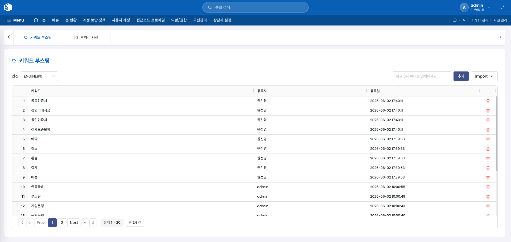

STT 인식 품질을 높이기 위한 단어 사전을 관리하는 화면입니다. **키워드 부스팅**과 **후처리 사전** 두 탭으로 구성됩니다.

**키워드 부스팅** 탭에서는 STT가 특정 단어를 더 잘 인식하도록 강조할 키워드를 등록합니다. 한글 6자 이내의 키워드를 입력하거나, 엑셀 파일로 여러 개를 한 번에 올릴 수 있습니다. **템플릿 다운로드**로 양식을 내려받아 작성 후 올릴 수 있습니다.

**후처리 사전** 탭은 STT 결과에서 특정 단어를 다른 단어로 자동 치환하는 규칙을 관리합니다. 잘못 인식되는 단어나 표준화가 필요한 표현을 등록해두면 변환 결과에 자동 적용됩니다. 항목을 두 번 클릭하면 편집 창이 열립니다.

#### 사용 방법 — 키워드 부스팅 등록

1. **엔진**을 선택합니다.
2. **키워드 입력란**에 강조할 단어(한글 6자 이내)를 입력한 뒤 **추가** 버튼을 누릅니다.
3. 여러 키워드를 한 번에 등록하려면 **Import → 엑셀 일괄 추가**를 선택합니다.

#### 화면 항목 — 키워드 부스팅 탭

| 항목 | 설명 |
|---|---|
| 엔진 | 적용할 STT 엔진 선택 |
| 키워드 | 부스팅할 단어 (한글 6자 이내) |
| 등록자 | 키워드를 등록한 계정 |
| 등록일 | 등록된 날짜 |

#### 화면 항목 — 후처리 사전 탭

| 항목 | 설명 |
|---|---|
| 변경할 단어 | 원본 인식 결과에서 치환 대상 단어 |
| 수정 단어 | 치환 후 표시될 단어 |
| 사용여부 | 해당 치환 규칙의 활성화 여부 |

---

### 인식률측정 관리

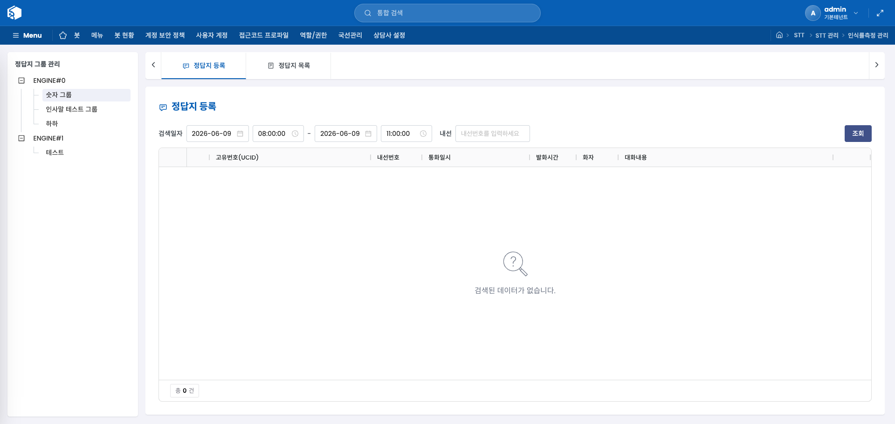

STT 학습에 사용하는 정답지(레퍼런스 데이터)를 엔진과 그룹 단위로 관리하는 화면입니다. 왼쪽 목록에서 엔진을 선택하면 해당 엔진의 그룹 목록과 새 그룹 추가 입력란이 나타납니다. 그룹을 선택하면 오른쪽에 **정답지 등록**과 **정답지 목록** 탭이 표시됩니다.

#### 사용 방법 — 그룹 추가

1. 왼쪽 목록에서 엔진(ENGINE#0 또는 ENGINE#1)을 선택합니다.
2. **그룹명** 입력란에 이름을 입력하고 **추가** 버튼을 누릅니다.

#### 정답지 등록 탭

그룹을 선택하면 나타나는 첫 번째 탭입니다. 실제 통화 음성을 STT 변환한 대화 내용을 조회하고, 정확한 문장으로 수정해 정답지로 등록할 수 있습니다.

**검색 조건**에서 조회 기간(날짜·시간 범위)과 내선번호를 지정한 뒤 **조회** 버튼을 누르면 해당 기간의 발화 목록이 표시됩니다. 같은 날짜 기준으로 최대 3시간, 날짜를 달리하면 최대 1주일까지 조회할 수 있으며, 하루를 초과하는 기간을 조회할 때는 내선번호 입력이 필수입니다.

목록에서 음성 파일이 있는 행은 재생 버튼(▶)으로 실제 통화 음성을 들어볼 수 있습니다. **대화내용** 셀을 클릭하면 내용을 직접 편집할 수 있으며, 수정이 끝난 행에서 **등록** 버튼을 누르면 해당 문장이 이 그룹의 정답지로 저장됩니다.

| 항목 | 설명 |
|---|---|
| (재생) | 해당 발화 구간의 음성을 재생하거나 정지합니다. |
| 고유번호(UCID) | 통화를 식별하는 고유 번호입니다. |
| 내선번호 | 해당 통화가 처리된 내선번호입니다. |
| 통화일시 | 통화가 이루어진 날짜와 시간입니다. |
| 발화시간 | 해당 발화 구간의 길이(초)입니다. |
| 화자 | 발화자 구분으로 고객·상담원·통합 중 하나입니다. |
| 대화내용 | STT 변환 결과 문장으로, 클릭해 직접 수정할 수 있습니다. 한글만 입력 가능합니다. |
| (등록) | 해당 행의 대화내용을 정답지로 등록합니다. |

#### 정답지 목록 탭

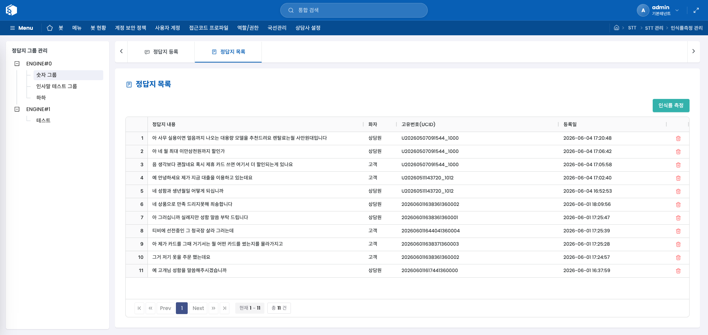

이 그룹에 등록된 정답지 전체를 확인하는 탭입니다. 목록 상단의 **인식률 측정** 버튼을 누르면 현재 등록된 정답지를 기준으로 STT 인식률을 측정하는 화면이 열립니다. 각 항목 오른쪽의 삭제 버튼으로 불필요한 정답지를 제거할 수 있습니다.

| 항목 | 설명 |
|---|---|
| 정답지 내용 | 등록된 정답 문장입니다. |
| 화자 | 해당 정답지의 화자 구분으로 고객·상담원·통합 중 하나입니다. |
| 고유번호(UCID) | 원본 통화를 식별하는 고유 번호입니다. |
| 등록일 | 정답지가 등록된 날짜와 시간입니다. |

---

### 내선 관리

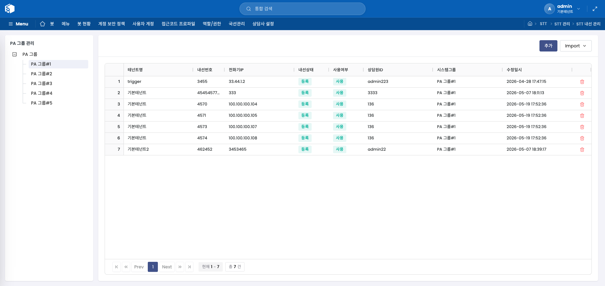

STT 시스템에 연결된 내선번호를 PA그룹 단위로 관리하는 화면입니다. 왼쪽 PA그룹 목록에서 그룹을 선택하면 해당 그룹의 내선 목록이 오른쪽에 표시됩니다. **추가** 버튼으로 개별 등록하거나, **Import**로 엑셀 파일을 이용한 일괄 등록을 할 수 있습니다. 항목을 두 번 클릭하면 편집 창이 열립니다.

#### 사용 방법 — 내선 일괄 등록

1. **Import → 엑셀 일괄 추가**를 선택합니다.
2. **템플릿 다운로드**로 양식을 내려받아 내선 정보를 입력합니다.
3. 작성된 파일을 업로드합니다.

#### 화면 항목

| 항목 | 설명 |
|---|---|
| 테넌트명 | 내선이 속한 테넌트 이름 |
| 내선번호 | 등록된 내선 번호 |
| 전화기IP | 내선 단말기의 IP 주소 |
| 내선상태 | 현재 내선 연결 상태 |
| 사용여부 | 내선의 활성화 여부 |
| 상담원ID | 해당 내선을 사용하는 상담원 계정 |
| 시스템그룹 | 소속 시스템 그룹 |
| 수정일시 | 정보가 마지막으로 수정된 날짜와 시간 |

---

### 재처리 현황

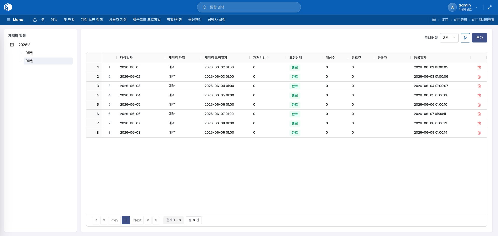

특정 날짜의 STT 처리를 다시 요청하고 진행 상태를 확인하는 화면입니다. 왼쪽 날짜 목록(연·월 단위)에서 조회할 날짜를 선택하면 해당 날짜의 재처리 요청 목록이 오른쪽에 표시됩니다. **추가** 버튼으로 새 재처리 요청을 등록할 수 있으며, 모니터링 기능으로 처리 상태를 주기적으로 자동 갱신할 수 있습니다.

#### 화면 항목

| 항목 | 설명 |
|---|---|
| 대상일자 | 재처리할 통화 데이터의 날짜 |
| 재처리 타입 | 재처리 방식 구분 |
| 재처리 요청일자 | 요청이 접수된 날짜와 시간 |
| 재처리건수 | 재처리 대상 건수 |
| 요청상태 | 현재 재처리 진행 상태 |
| 대상수 | 전체 대상 데이터 수 |
| 완료건 | 처리 완료된 건수 |
| 등록자 | 요청을 등록한 계정 |
| 등록일자 | 요청이 등록된 날짜와 시간 |

---

### STT 파일업로드

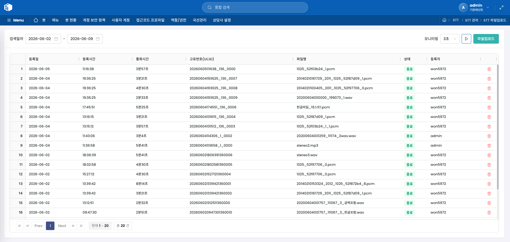

음성 녹취 파일을 직접 업로드하여 STT 변환을 요청하는 화면입니다. 날짜 범위로 업로드 이력을 조회하고, **파일업로드** 버튼으로 새 파일을 올릴 수 있습니다. 변환이 완료된(종료 상태) 항목을 두 번 클릭하면 변환 결과 상세 내용을 확인할 수 있습니다. 모니터링 기능으로 업로드·변환 진행 상태를 자동으로 갱신할 수 있습니다.

#### 화면 항목

| 항목 | 설명 |
|---|---|
| 등록일 | 파일이 업로드된 날짜 |
| 시간 | 파일이 업로드된 시각 |
| 통화시간 | 녹취 파일의 통화 길이 |
| UCID | 통화 고유 식별번호 |
| 파일명 | 업로드된 녹취 파일 이름 |
| 상태 | 현재 STT 변환 처리 상태 |
| 등록자 | 파일을 업로드한 계정 |

---

## STT 모니터링

### STT 채널현황

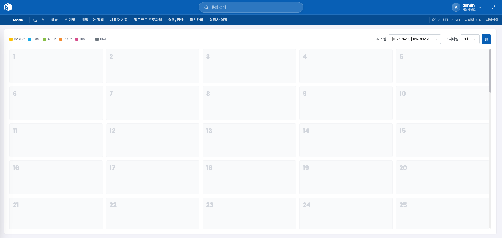

STT 시스템의 채널별 실시간 처리 현황을 카드 형태로 보여주는 화면입니다. 각 카드는 채널 번호, 현재 처리 중인 통화의 UCID와 상담사 이름을 표시하며, 처리 시간에 따라 카드 색상이 달라집니다. 사용 중이지 않은 채널은 회색 빈 카드로 표시됩니다. 카드를 클릭하면 해당 채널에서 진행 중인 통화의 실시간 STT 변환 내용을 확인할 수 있습니다.

화면 상단의 색상 범례는 통화 지속 시간을 나타냅니다. 배치 처리 중인 채널은 회색으로 표시됩니다. **시스템** 선택으로 특정 STT 시스템의 채널만 볼 수 있으며, **모니터링** 간격(3·5·10·30초)과 시작/중지 버튼으로 자동 갱신을 제어할 수 있습니다.

#### 색상 범례

| 색상 | 의미 |
|---|---|
| 노란색 | 통화 진행 1분 미만 |
| 파란색 | 통화 진행 1~3분 |
| 초록색 | 통화 진행 4~6분 |
| 주황색 | 통화 진행 7~9분 |
| 분홍색 | 통화 진행 10분 이상 |
| 회색 | 배치 처리 중 |

---

### STT 내선별 진행현황

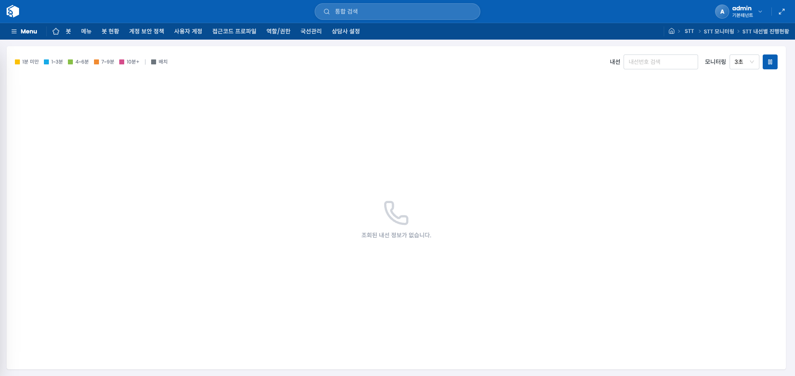

내선번호 단위로 STT 처리 진행 상태를 실시간으로 확인하는 화면입니다. 각 내선 카드에는 내선번호, 진행률, 현재 처리 중인 통화의 UCID와 상담사 이름이 표시됩니다. 처리 시간에 따른 색상 범례는 STT 채널현황과 동일합니다.

**내선번호 검색** 입력란으로 특정 내선만 필터링할 수 있으며, 모니터링 설정으로 자동 갱신 주기를 조절할 수 있습니다. 카드를 클릭하면 해당 내선에서 진행 중인 통화의 실시간 STT 변환 내용을 확인할 수 있습니다.

---

### STT 콜별 진행현황

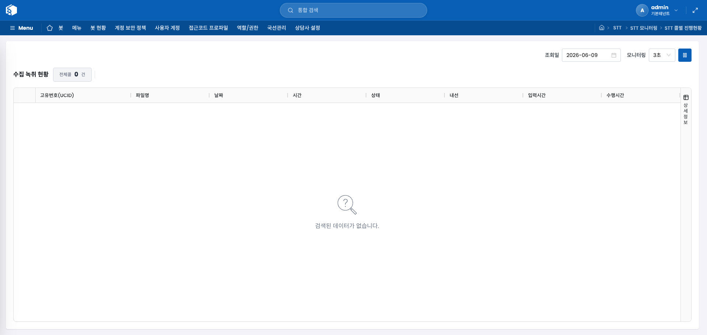

특정 날짜의 통화별 STT 처리 상태를 한눈에 확인하는 화면입니다. 상단 **수집 녹취 현황**에서 전체 콜 수와 상태별(진행중·대기중·완료 등) 건수를 요약 정보로 보여줍니다. 아래 목록에서 개별 통화의 처리 상태와 세부 시간 정보를 확인할 수 있습니다.

**조회일** 선택으로 날짜를 변경하고, 모니터링 기능으로 실시간 업데이트를 설정할 수 있습니다.

#### 화면 항목

| 항목 | 설명 |
|---|---|
| 고유번호(UCID) | 통화 고유 식별번호 |
| 파일명 | 녹취 파일 이름 |
| 날짜 | 통화 날짜 |
| 시간 | 통화 시작 시각 |
| 상태 | 현재 STT 처리 상태 |
| 내선 | 통화에 사용된 내선 번호 |
| 입력시간 | 처리 요청이 시스템에 접수된 시각 |
| 수행시간 | STT 변환 처리에 소요된 시간 |

---

### STT 대시보드

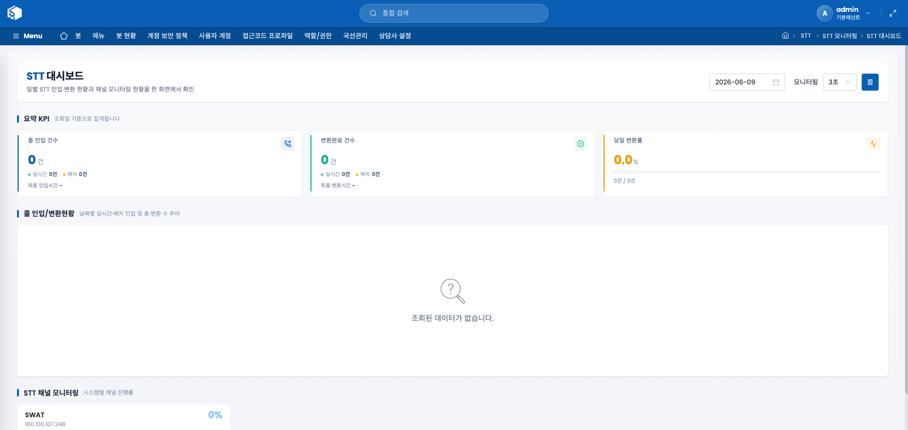

STT 시스템의 하루치 인입·변환 현황과 채널 모니터링 상태를 한 화면에서 종합적으로 확인하는 대시보드입니다.

**요약 KPI** 섹션에는 조회일 기준의 3가지 핵심 수치가 표시됩니다. **총 인입 건수**는 실시간과 배치로 인입된 통화 수의 합계이며, **변환완료 건수**는 STT 변환이 완료된 통화 수, **당일 변환률**은 인입 대비 변환 완료 비율을 백분율로 나타냅니다. 각 수치에는 실시간/배치 구분 건수와 최종 처리 시각도 함께 표시됩니다.

**콜 인입/변환현황** 차트는 날짜별 실시간 인입(막대), 배치 인입(막대), 총 변환 수(꺾은선)를 한 그래프에 보여주어 처리 추이를 파악할 수 있습니다.

**STT 채널 모니터링** 섹션은 시스템별 채널 진행률을 카드 형태로 보여줍니다. 각 카드에서 진행 중 채널 수와 전체 채널 수, 진행률을 확인할 수 있으며, 카드를 클릭하면 해당 시스템의 STT 채널현황 화면으로 이동합니다.

**조회일** 선택으로 날짜를 변경하고, 모니터링 설정으로 대시보드 전체의 자동 갱신 주기를 조절할 수 있습니다.
